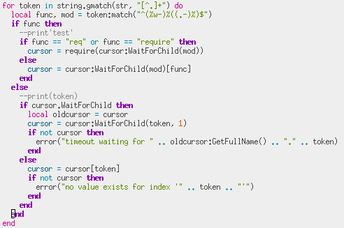
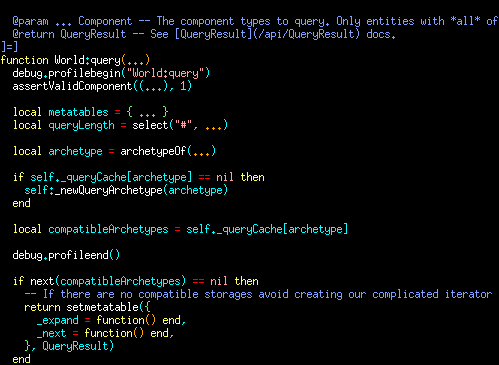

# luau-vim

Vimscript syntax highlighting plugin for Luau and Roblox Luau. 
This plugin intends to provide good support for Luau and Roblox Luau in Vim, Neovim, and other flavors of Vim.

It's still experimental. You may be surprised by highlighting that bleeds over or appears missing. If that's important to you, it's important to [create an issue](https://github.com/polychromatist/luau-vim/issues).

## Screenshots

Here you can see some screenshots of luau-vim v0.1, in the [moonfly theme](https://github.com/bluz71/vim-moonfly-colors).
Please note it's an older version.

## Installation
Installing is as simple as pulling the repo with your preferred plugin manager.

If you're new, the quickest way to get set up is by first installing [plug.vim](https://github.com/vim-plug/plug.vim).
Make sure to read how to use the manager.
After that, you write `Plug 'polychromatist/luau-vim'` in the critical section of your vimrc.

There is also [minpac](https://github.com/k-takata/minpac), which boasts minimalism.

If you don't want a plugin manager, please see a guide on [how to install vim plugins natively](https://www.youtube.com/watch?v=3fkTCkc687s).

## Init Variables

Modify these variables in the head of your vimrc, before the plugin is loaded.

Example: `let g:luauRobloxIncludeAPIDump = 1`. Note that a value of 1 means on, or set, similarly with 0 and off, or unset.

<table>
  <thead>
    <th>var</th>
    <th>info</th>
  </thead>
  <tbody>
    <tr>
      <td><code>luauHighlightAll = 0 | 1</code></td>
      <td>Setting to control all highlighting settings. When this is defined, all subordinate <code>luauHighlight*</code> variables will take on the value that is given, no matter what. Note that this does not control highlighting for syntax clusters that don't have settings, such as Luau keywords, expressions, etc. </td>
    </tr>
    <tr>
      <td><code>luauHighlightBuiltins = 0 | 1</code></td>
      <td>default 1. If set, Luau builtins will take on <code>luauFunction</code> highlight group.</td>
    </tr>
    <tr>
      <td><code>luauHighlightTypes = 0 | 1</code></td>
      <td><em>Not Fully Implemented</em> default 1. If set, syntax groups will be modified to try to match types in cases like binding lists or after function headers, and will fully realize top/block-level type definitions. If not, such definitions are treated like tables, and type annotations  may appear strange. Not recommended as off when dealing with strictly typed code.</td>
    </tr>
    <tr>
      <td><code>luauHighlightRoblox = 0 | 1</code></td>
      <td>default 1. If set, Luau builtins will be extended by Roblox datatypes <a href="https://create.roblox.com/docs/reference/engine/datatypes">as they appear on the docs</a>. None of these datatypes are generated in the plugin by fetching the Roblox API - they are manually defined. However, any applicable Roblox API fetched syntax rules are impossible unless this is setting is on.</td>
    </tr>
    <tr>
      <td><code>luauIncludeRobloxAPIDump = 0 | 1</code></td>
      <td><em>Not Fully Implemented</em> default 0. If set, and as long as <code>luauHighlightRoblox</code> is set, luau.vim (v0.2.1+) will attempt to grab Roblox APIs from a <a href="https://github.com/MaximumADHD/Roblox-Client-Tracker">continuously refreshed, user-defined API endpoint</a>. The APIs are, for now, parsed using regex on the compact, raw text format specified in the linked repo rather than JSON.</td>
    </tr>
    <tr>
      <td><code>luauRobloxAPIDumpURL = [string_url]</code></td>
      <td>default <code>'https://raw.githubusercontent.com/MaximumADHD/Roblox-Client-Tracker/roblox/API-Dump.txt'</code>. This setting cannot be used on a JSON endpoint for now.</td>
    </tr>
    <tr>
      <td><code>luauRobloxAPIDumpDirname = [string_fname]</code></td>
      <td>default <code>'robloxapi'</code>. This string specifies the path relative to the plugin directory where any fetched Roblox API data lives.</td>
    </tr>
  </tbody>
</table>

## [Support](https://luau-lang.org)

<table>
  <caption>Legend</caption>
  <thead>
    <th>glyph</th>
    <th>meaning</th>
  </thead>
  <tbody>
    <tr><td>y</td><td>implemented</td></tr>
    <tr><td>y*</td><td>implemented, but still experimental</td></tr>
    <tr><td>m</td><td>planned next minor version</td></tr>
    <tr><td>n</td><td>unsupported / not yet implemented</td></tr>
  </tbody>
</table>

<table>
  <caption>Support</caption>
  <thead>
    <th>category</th>
    <th>item</th>
    <th>status</th>
  </thead>
  <tbody>
    <tr>
      <td><a href="https://luau-lang.org/syntax">syntax</a></td>
      <td>literals</td><td>y</td>
    </tr>
    <tr>
      <td />
      <td>continue</td><td>y</td>
    </tr>
    <tr>
      <td />
      <td>compoundop</td><td>y</td>
    </tr>
    <tr>
      <td />
      <td>type annotations</td><td>m</td>
    </tr>
    <tr>
      <td />
      <td>exp: if-then-else</td><td>y*</td>
    </tr>
    <tr>
      <td><a href="https://luau-lang.org/linting">linting</a></td>
      <td>linter</td><td>n1</td>
    </tr>
    <tr>
      <td />
      <td>directives</td><td>y</td>
    </tr>
    <tr>
      <td><a href="https://luau-lang.org/grammar">grammar</a></td>
      <td>exp</td><td>y*</td>
    </tr>
    <tr>
      <td />
      <td>stat</td><td>y*</td>
    </tr>
    <tr>
      <td />
      <td><a href="https://luau-lang.org/typecheck">Type</a></td><td>m</td>
    </tr>
    <tr>
      <td><a href="https://luau-lang.org/library">library</a></td>
      <td>globals</td><td>y</td>
    </tr>
    <tr>
      <td />
      <td><code>math</code>, etc</td><td>y</td>
    </tr>
    <tr>
      <td><a href="https://create.roblox.com/docs/engine">roblox</a></td>
      <td>globals</td><td>y</td>
    </tr>
    <tr>
      <td />
      <td>datatype</td><td>y*</td>
    </tr>
    <tr>
      <td />
      <td>types</td><td>m2</td>
    </tr>
    <tr>
      <td />
      <td>Enum</td><td>m2</td>
    </tr>
  </tbody>
</table>

(1) A lightweight interface to a Roblox linter/LSP is planned. I recommend [ALE](https://github.com/dense-analysis/ale) which supports the (Roblox) Luau linter [selene](https://github.com/Kampfkarren/selene)

(2) The autoload module is being prepared to fetch Roblox API data in order to generate proper highlight groups on Roblox types and Enums, etc.
