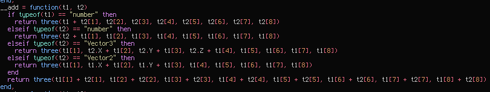
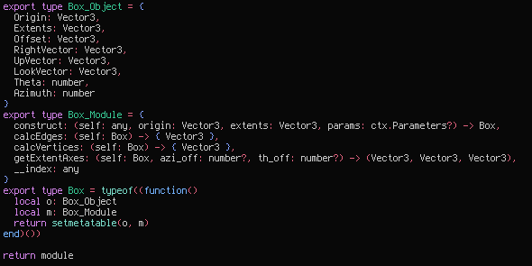
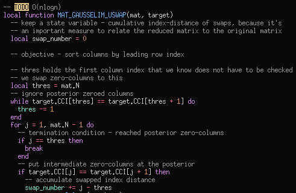

# luau-vim

Vimscript syntax highlighting plugin for Luau and Roblox Luau. 
This plugin intends to provide good support for Luau and Roblox Luau in Vim, Neovim and other vimscript plugin respecting flavors of Vim, with fine control.

It's still experimental. You may be surprised by highlighting that bleeds over or appears missing. If that's important to you, it's important to [create an issue](https://github.com/polychromatist/luau-vim/issues).

## Screenshots

Here you can see some screenshots of luau-vim v0.1, in the [moonfly theme](https://github.com/bluz71/vim-moonfly-colors).
Please note it's an older version.

## Installation
Installing is as simple as pulling the repo with your preferred plugin manager.

If you're new, the quickest way to get set up is by first installing [plug.vim](https://github.com/vim-plug/plug.vim).
Make sure to read how to use the manager.
After that, you write `Plug 'polychromatist/luau-vim` in the critical section of your vimrc.

There is also [minpac](https://github.com/k-takata/minpac), which boasts minimalism.

If you don't want a plugin manager, please see a guide on [how to install vim plugins natively](https://www.youtube.com/watch?v=3fkTCkc687s).

## Init Variables

`let g:luau_roblox = 0 | 1 (default)`

## [Support](https://luau-lang.org)

<table>
  <caption>Legend</caption>
  <thead>
    <th>glyph</th>
    <th>meaning</th>
  </thead>
  <tbody>
  </tbody>
</table>
y: implemented

y%: mostly implemented / implemented, but target is volatile

%: partially implemented (i.e. somewhat works)

n: not yet implemented / implementation status unknown

y!: implemented, recent issues

x: no intention to implement

### Core
<table>
  <caption>Core Syntax</caption>

  <tr>
  </tr>
</table>
- base Lua syntax: y
  - inherited from default Lua vim style
- base Luau syntax: y%
  - inline "if"-style x-ary operator: n
  - type: n
- Roblox functions: y%
  - auto-generate: %

### Other
- method invocations: y%
  - need to make optional
- linting: n
